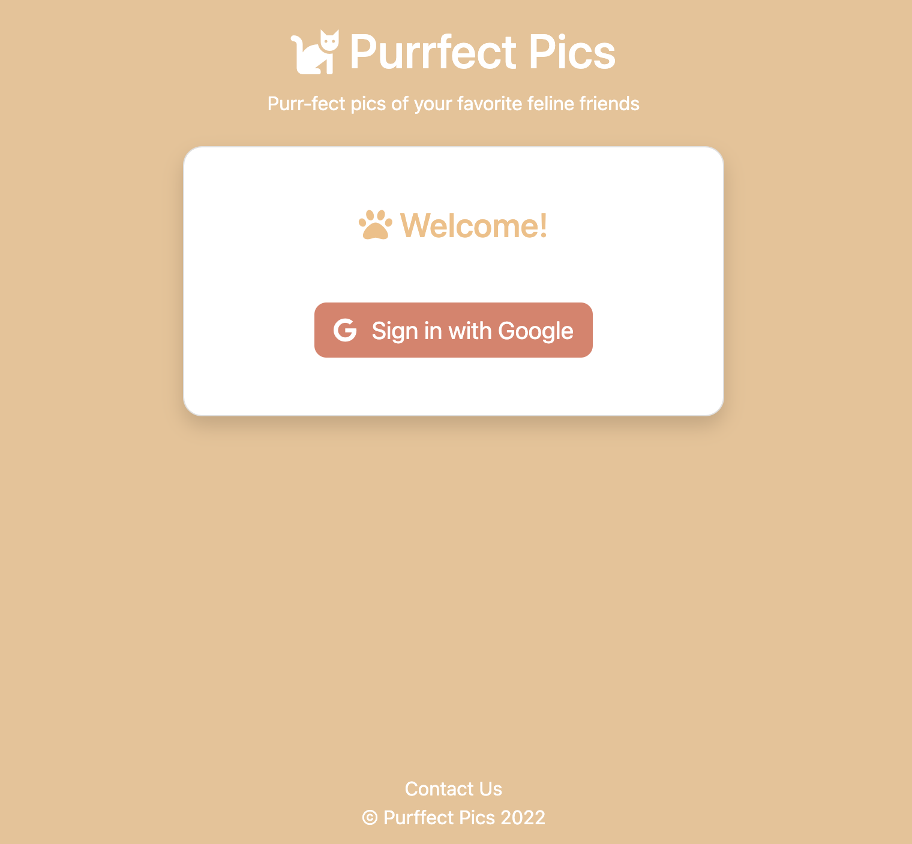

# Purrfect Pics

Purrfect Pics is fun social media app for people to share and connect through their love of cats.

Users can log in to access their own personal profile containing their posts. A feed containing posts from every user is available to help connect users to other fellow cat lovers. Users can interact with posts by liking and commenting to help boost community engagement.

## Screenshots



## Tech Stack

Node.js, MongoDB, Express.js, Passport.js, Bootstrap CSS

## Usage

View the live deployment here:

[Purrfect Pics App Live Deployment](#)

## Run Locally

**Requirements before starting:**

- [MongoDB Atlas URI](https://www.mongodb.com/atlas/database)

Install dependencies

```bash
  npm install
```

Create environment variable file

```bash
  cd config
  touch .env
```

Add the following entries to the environment variable file (.env)

```bash
  PORT = 4000
  # MongoDB
  DB_STRING = MONGODB-URI-PLACEHOLDER
  # Cloudinary
  CLOUD_NAME = CLOUD-NAME-PLACEHOLDER
  API_KEY = API-KEY-PLACEHOLDER
  API_SECRET = API-SECRET-PLACEHOLDER
  # Google OAuth
  GOOGLE_CLIENT_ID = GOOGLE-CLIENT-ID-PLACEHOLDER
  GOOGLE_CLIENT_SECRET =  GOOGLE-CLIENT-SECRET-PLACEHOLDER
```

Start the server

```bash
  npm run start
```

## Authors

- [@JaretBalba](https://www.github.com/jaretzbalba)

## License

[MIT](https://choosealicense.com/licenses/mit/)

## Optimizations

- Integrate React

## Lessons Learned:

- How to use moment.js to track when posts/comments were created for helpful user information
